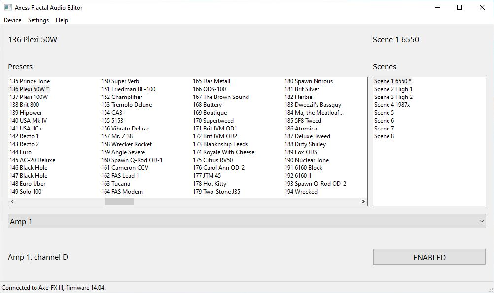

# Axess Fractal Audio Editor

A very basic client for Fractal Audio Axe-FX III and FM3. Provides a very simple, plain Windows interface for accessibility and ease of use. Developed for the audience where the official editor or other third party editors are not compatible with screen readers or other accessibility software.

Available for Windows only.

At the moment, the FM3 communication is slow and it might take 20 seconds for the list of presets to be retrieved.

## Keyboard shortcuts

Mimics the offical Fractal Audio editor.

Enter: Select the scene or preset from the list
Ctrl + PgUp/PgDn: Preset Up/Down
Ctrl + 1/2/3/4/5/6/7/8: Select a scene
Spacebar: bypass or engage the selected block

Optional function key shortcuts:

F1-F8: Scene selection
F11, F12: Preset Down/Up

## Download

Download the latest binary from the [Releases section](https://github.com/rudib/axess/releases). Note that the binaries are not signed and you'll have to convince Windows that this isn't malware.

## For developers

